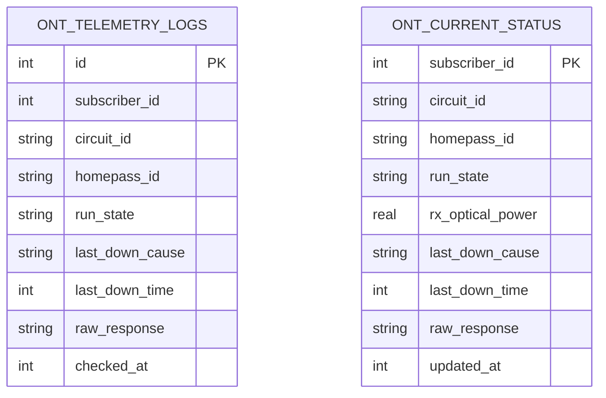

# 📡 Protelindo ONT Monitor - Production Database & Optimization Design

Dokumen ini mendokumentasikan arsitektur database SQLite dan **sistem optimasi kuota API** yang diterapkan dalam aplikasi pemantau ONT Protelindo.

---

## 🛠️ Arsitektur Database SQLite (`bun:sqlite`)

Untuk memastikan performa tinggi dengan penggunaan memori minimal di lingkungan VPS/server produksi, kami menggunakan driver bawaan Bun (`bun:sqlite`). Database disimpan secara lokal dalam satu file (`monitor.db`).

### Skema Tabel Produksi

Aplikasi menggunakan dua tabel utama untuk menyimpan data historis (time-series) dan keadaan terakhir (live state) perangkat ONT:

#### 1. Tabel `ont_telemetry_logs` (Historical Log)
Menyimpan seluruh riwayat pemantauan secara historis (*time-series*). Digunakan untuk audit dan pembuatan grafik analisis stabilitas.

* **Index**: `idx_homepass_check` pada kolom `(homepass_id, checked_at)` untuk pencarian riwayat yang cepat.

#### 2. Tabel `ont_current_status` (Live State)
Menyimpan hanya **1 baris data status terakhir** per pelanggan. Digunakan oleh mesin optimasi (*skip logic*) untuk mengetahui status terakhir tanpa perlu memindai jutaan baris log historis.

* **Index**:
  * `idx_current_signal` pada `(run_state, rx_optical_power)` di mana `run_state = 'online'` (untuk menyaring sinyal terlemah).
  * `idx_current_down_cause` pada `(run_state, last_down_cause)` di mana `run_state = 'offline'` (untuk penyaringan pemadaman listrik/dying-gasp).
  * `idx_current_downtime` pada `(run_state, last_down_time)` di mana `run_state = 'offline'` (untuk mengurutkan gangguan terlama).

---

## ⚡ Sistem Optimasi & Penghematan Kuota API

Dengan total puluhan ribu pelanggan, melakukan pengecekan berkala secara mentah akan membebani kuota API Protelindo hingga jutaan hit per hari. Untuk menghemat kuota API hingga **80% - 90%**, kami menerapkan tiga lapis *Skip Logic* cerdas sebelum memanggil API Protelindo:

### Lapis 1: Cooldown sudden Power Loss (*Dying-Gasp Skip*)
* **Aturan**: Jika status terakhir ONT adalah `offline` dengan penyebab `dying-gasp` (mati listrik mendadak di rumah pelanggan), pengecekan selanjutnya akan diskip jika jaraknya dengan pengecekan terakhir kurang dari **8 jam** (konfigurasi: `DYING_GASP_SKIP_HOURS`).
* **Rasional**: Mati listrik pada area pelanggan biasanya memakan waktu beberapa jam untuk pulih. Memanggil API terus-menerus pada ONT mati listrik hanya membuang kuota.

### Lapis 2: Cooldown Sinyal Optik Sempurna (*Excellent Signal Skip*)
* **Aturan**: Jika status terakhir ONT adalah `online` dengan daya sinyal terima (Rx) lebih baik dari **-20 dBm** (konfigurasi: `GOOD_SIGNAL_THRESHOLD`), pengecekan akan diskip jika dilakukan kurang dari **6 jam** dari pengecekan terakhir (konfigurasi: `GOOD_SIGNAL_SKIP_HOURS`).
* **Rasional**: ONT dengan sinyal optik sangat sehat jarang mengalami fluktuasi redaman mendadak. Mengurangi frekuensi pemantauan untuk mereka sangat aman.

### Lapis 3: Progressive Exponential Backoff untuk ONT Offline
* **Aturan**: Untuk ONT dengan status `offline` selain karena `dying-gasp` (misal karena redaman putus/LOS atau status *unknown*), frekuensi pemantauan akan dikurangi secara bertahap berdasarkan lamanya durasi perangkat tersebut mati:
  
  | Durasi Mati ONT (`elapsed_downtime`) | Cooldown / Skip Window | Konfigurasi `.env` |
  | :--- | :--- | :--- |
  | **< 1 Jam** | **0 menit** (Cek setiap siklus) | *Selalu dipantau ketat* |
  | **1 s.d 6 Jam** | **60 menit** (1 jam) | `OFFLINE_BACKOFF_1_TO_6_HOURS_SKIP_MINUTES` |
  | **6 s.d 24 Jam** | **240 menit** (4 jam) | `OFFLINE_BACKOFF_6_TO_24_HOURS_SKIP_MINUTES` |
  | **> 24 Jam** | **720 menit** (12 jam) | `OFFLINE_BACKOFF_ABOVE_24_HOURS_SKIP_MINUTES` |

* **Rasional**: Jika ONT telah mati selama lebih dari 24 jam (biasanya akibat isolir pelanggan atau kerusakan fisik kabel optik utama/LOS), pengecekan setiap 5 menit adalah pemborosan. Melakukan pengecekan setiap 12 jam sekali sudah cukup memadai untuk mendeteksi kapan perangkat tersebut kembali hidup.

---

> [!IMPORTANT]
> Seluruh parameter di atas dikendalikan sepenuhnya melalui variabel lingkungan dalam file `.env`, memungkinkan tim operasional NOC mengubah ambang batas daya sinyal maupun jendela waktu cooldown secara real-time tanpa menyentuh kode program.
