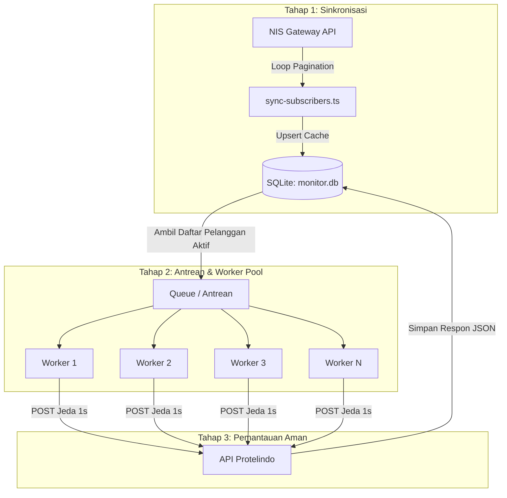

# Strategi Skala Besar: Memantau Seluruh Pelanggan

Saat ini kita memiliki puluhan ribu pelanggan terdaftar di NIS Gateway. 
Jika kita memantau seluruh pelanggan satu per satu secara sekuensial murni dengan jeda 1 detik:
$$\text{Total Waktu} = N \text{ detik} \approx \text{beberapa jam}$$
Waktu ini terlalu lambat untuk sebuah siklus *real-time monitoring* dalam skala besar. Di sisi lain, jika kita menembak semuanya sekaligus secara paralel, server Protelindo akan memblokir koneksi kita karena terdeteksi sebagai serangan (*Rate Limit Exceeded*).

Berikut adalah rancangan arsitektur terbaik untuk memantau skala puluhan ribu pelanggan dengan aman dan cepat:

---

## 📐 Arsitektur Skala Besar (3 Pilar Utama)

---

## 🛠️ Langkah Implementasi Teknis

### Pilar 1: Sinkronisasi Data Pelanggan Lokal (`sync-subscribers.ts`)
Kita tidak boleh menembak API NIS Gateway (data seluruh pelanggan) di setiap kali pengecekan status ONT. Itu membebani server NIS dan memperlambat sistem kita.
* **Solusi**: Kita buat skrip sinkronisasi berkala (misal: dijalankan 1x sehari pukul 00:00).
* Skrip ini akan melakukan *looping pagination* (`page_size=100`) ke NIS Gateway, menarik semua data pelanggan, lalu menyimpannya ke tabel `subscribers` di database lokal kita (`monitor.db`).
* Pengecekan ONT berikutnya cukup membaca daftar pelanggan langsung dari SQLite lokal kita secara instan!

### Pilar 2: Pola Worker Pool (Rate-Limited Concurrency)
Untuk mempercepat waktu pengecekan tanpa melanggar *rate limit*, kita menggunakan metode **Worker Pool**.
Misalkan kita pasang **$W = 10$ Worker**:
* Antrean (*queue*) berisi seluruh pelanggan dibagikan kepada 10 Worker yang berjalan secara paralel.
* Masing-masing Worker melakukan request ke Protelindo secara mandiri, lalu beristirahat selama 1 detik sebelum mengambil antrean berikutnya.
* **Hasil Kecepatan**: Kita dapat melakukan 10 request per detik secara aman.
  Kecepatan siklus monitoring akan meningkat hingga 10 kali lipat secara instan (misalnya, jika sebelumnya memakan waktu beberapa jam, kini dapat diselesaikan dalam hitungan menit).
* Jika rate limit server Protelindo membolehkan *concurrency* yang lebih tinggi, kita tinggal menaikkan jumlah Worker secara proporsional untuk memangkas waktu pemantauan lebih jauh lagi!

### Pilar 3: Partisi Prioritas Pengecekan (Rotational Scheduling)
Tidak semua ONT pelanggan harus dicek setiap 15 menit. Kita bisa mengelompokkan pelanggan berdasarkan profil layanan:
1. **VIP / Dedicated Business (SLA Tinggi)**: Dicek setiap 5 menit.
2. **Regular Home (SLA Standar)**: Dicek setiap 30 atau 60 menit secara berputar.
Dengan membagi segmen ini, beban request ke server API akan terdistribusi sangat merata sepanjang hari.

---

> [!TIP]
> **Rekomendasi Langkah Awal**:
> Kita dapat mulai mengimplementasikan **Pilar 1 (Sinkronisasi Data Pelanggan)** terlebih dahulu dengan membuat berkas **`sync.ts`**. Berkas ini akan bertugas menarik seluruh data pelanggan dari NIS Gateway dengan aman menggunakan pagination, lalu memasukkannya ke database lokal.
> 
> Apakah Anda ingin saya membuatkan berkas **`sync.ts`** tersebut sekarang agar kita memiliki basis data seluruh pelanggan Anda di SQLite lokal?
