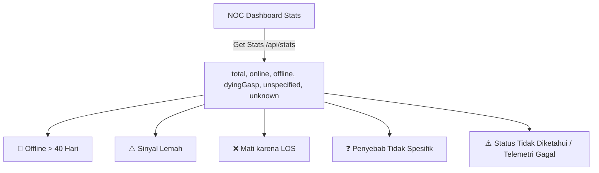

# 📡 OPTRA Full-Stack Integration Walkthrough

Kami telah sukses mengintegrasikan dua list diagnosa baru yang diminta langsung ke dalam **NOC Incident Command Center Dashboard** menggunakan PostgreSQL (Bun SQL) dan React (DaisyUI/Tailwind CSS v4):

1. **Mati dengan penyebab tidak spesifik yang dicatat oleh OLT** (`last_down_cause = '--'`, `null`, atau kosong).
2. **Status tidak diketahui / terjadi kegagalan penarikan data telemetri** (`run_state = 'unknown'` atau `'error'`).

Berikut adalah rincian teknis dari integrasi full-stack ini:

---

## 🛠️ Perubahan yang Dilakukan

### 1. Database Layer & Raw SQL Performance (`src/database.ts`)
Kami memperluas skema dan fungsi database PostgreSQL untuk mendukung pencatatan status dan manajemen sesi:
* **Tabel `ont_auth_session`**: Dibuat sebagai tabel sesi terpusat untuk menyimpan `access_token`, `refresh_token`, `expires_in`, dan `created_at` secara aman. Ini menjamin **Hono Web Server** dan **Daemon Sweeper** (yang berjalan di proses OS terpisah) dapat saling berbagi sesi aktif secara real-time.
* **Session Helpers**: Menambahkan metode `getSession()` dan `saveSession()` asinkron pada kelas `TelemetryDatabase` untuk mengelola sesi langsung di database.
* **Agregat Dashboard**: Mengoptimalkan fungsi `getStats()` untuk menghitung secara langsung jumlah ONT mati tanpa sebab spesifik (OLT `--`) dan ONT dengan telemetri gagal.
* **Query Security**: Menggunakan parameterized template literal asinkron `Bun.sql` untuk menjamin proteksi penuh dari SQL Injection.

🔗 **Lihat Berkas**: [database.ts](../src/database.ts#L404-L430)

### 2. OAuth2 Session & Refresh Token Flow (`src/protelindo.ts`)
Mengembangkan `ProtelindoAuthManager` menjadi 100% stateless dan mendukung *Self-Healing Token*:
* **Penghapusan Cache Lokal**: Berkas fisik `session.json` dihapus sepenuhnya. Seluruh penyimpanan sesi kini tersimpan secara aman di PostgreSQL.
* **Refresh Token Flow**: Menambahkan metode `refresh(refreshToken)` untuk memanggil API autentikasi Protelindo dengan `grant_type=refresh_token`.
* **Graceful Fallback**: Di dalam `getValidAccessToken()`, ketika sistem mendeteksi token kedaluwarsa, ia akan mencoba melakukan *token refresh*. Jika *refresh token* gagal atau kedaluwarsa, ia akan secara otomatis melakukan fallback aman ke *full login* menggunakan kredensial username/password.

### 3. API Routing Layer (`src/server.ts`)
Memastikan API Hono menyajikan data dengan query parameter dinamis:
* `/api/outages?type=unspecified`: Mengembalikan data ONT dengan gangguan tidak spesifik (OLT cause `--`).
* `/api/outages?type=unknown`: Mengembalikan data ONT yang mengalami kegagalan telemetry.
* `/api/stats`: Menyertakan variabel stats baru `unspecified` dan `unknown` secara real-time.

🔗 **Lihat Berkas**: [server.ts](../src/server.ts#L55-L83)

### 3. High-Fidelity UI React Layer (`frontend/src/App.tsx`)
Kami mendesain tab navigasi interaktif baru dengan indikator visual dan performa tingkat produksi:
* **State Management**: Ditambahkan state baru `unspecifiedOutages` dan `unknownOutages`.
* **Polled Syncing**: `fetchData` diperbarui untuk melakukan sinkronisasi asinkron setiap 10 detik.
* **Premium Tabs**: Menambahkan tombol tab navigasi dengan badge angka real-time:
  * `❓ Penyebab Tidak Spesifik (--)` (menampilkan badge jumlah ONT mati tanpa sebab spesifik).
  * `⚠️ Status Tidak Diketahui` (menampilkan badge jumlah ONT dengan telemetry gagal).
* **Detailed Tables**:
  * Menampilkan tabel yang ramah NOC lengkap dengan Circuit ID, durasi downtime relatif, penyebab, dan status telemetri yang terurai dari respons mentah JSON.
  * Baris tabel mendukung interaksi klik untuk memuat riwayat audit rinci di panel samping **History Analyzer**.

🔗 **Lihat Berkas**: [App.tsx](../frontend/src/App.tsx)

### 4. Real-Time ONT Live Status Trigger (Interactive Check)
Kami menambahkan kapabilitas baru yang memungkinkan NOC melakukan pengecekan seketika (*on-demand live check*):
* **Hono POST API Endpoint**: `POST /api/check/:subscriberId` untuk melakukan kueri langsung ke API OLT Protelindo untuk ONT tertentu secara asinkron. Hasilnya langsung disimpan ke database (`db.insertLog`) sehingga data riwayat selalu *up-to-date*.
* **Interactive Button**: Ditambahkan tombol **`⚡ Cek Status ONT Live`** di dalam panel samping **History Analyzer**. Saat diklik, tombol akan menampilkan status *loading spinner* dan memperbarui grafik serta status ONT seketika!

---

## 📊 Ilustrasi Grid Navigasi Baru

---

> [!NOTE]
> Prosedur kompilasi frontend (`tsc -b && vite build`) telah berjalan dengan **100% sukses** tanpa *warnings* tipe data TypeScript, menghasilkan bundel statis terkompresi di folder `frontend/dist/` yang siap disajikan oleh portal Hono.
